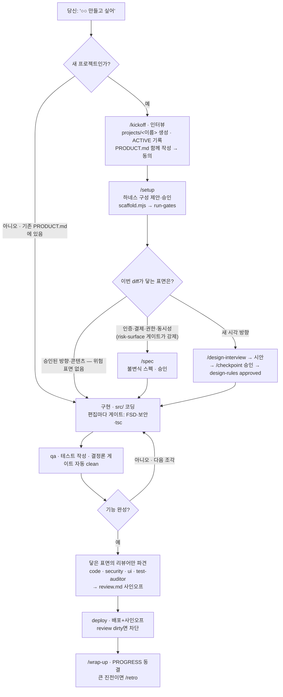

# 그래프 실행 엔진 — 트레이스와 사용법

`spec→design→implement→qa→review→deploy`를 **고정 순차 dispatch**가 아니라
**의존성 그래프 + dirty 전파**로 돌린다. 재작업 경로는 규칙으로 선언하지 않고 전파에서 **파생**된다.

## 유일한 규칙
> 상류가 dirty → 그에 의존하는 하류가 전부 dirty. 실행기는 dirty 노드를 상류부터 재실행하고,
> 완료 게이트가 통과하면 dirty를 해제한다. "다음에 어디로"는 어디에도 없다.

## 노드 상태 넷 — dirty · clean · rework · n/a

### rework — 통과했던 판정이 취소된 것
하류를 막는 것도, 프론티어에 뜨는 것도 `dirty` 와 똑같다. 갈리는 자리는 **하나뿐**이다:
Stop 훅이 턴을 막을지 정할 때 다르게 취급된다.

- 선언: `node gates/graph-stop.mjs --mark <노드> "<사유 한 줄>"` — **상태를 선언하지 않는다.**
  지금 `clean` 인 노드를 mark 하면 rework, 이미 dirty 면 dirty 다. 판별 재료가 이미 상태에 있어서
  따로 기록할 게 없고, "한 번도 승인 안 받은 것"이 rework 로 둔갑할 수도 없다.
- 하류는 rework 가 아니라 dirty 로 전파된다 — 하류는 거부된 게 아니라 상류가 흔들려 다시 하는 것이다.
- 해제: 따로 없다. release 조건(프론트매터·게이트)을 채우면 다른 상태와 똑같이 clean 으로 풀린다.
- 재작업 중에 그 노드의 파일을 고쳐도 rework 는 유지된다(해시 변경이 dirty 로 되돌리지 않는다).
  안 그러면 재작업하는 행위 자체가 거부 사실을 지운다.

**왜 필요한가.** 강제력이 두 겹이다 — ① 노드가 dirty 인 동안 하류가 못 간다 ② 게이트 실패면 턴이 안 끝난다.
문제는 ②가 ①을 푸는 길까지 막을 때다. `design-rules` 를 draft 로 내리면 그래프는 "디자인으로 돌아가라"고
처방하는데 `design/BEFORE_UI` 게이트는 같은 상태를 위반으로 본다. 푸는 유일한 길인 **사용자 승인**은
턴을 끝내야 도달하는데 그 턴이 안 끝난다. 실제로 3번 관찰됐고(2026-08-06·08-10·08-11) 2번은 회피했다 —
한 번은 게이트가 막으려던 바로 그 일(임의로 approved 로 되돌리기)을 할 뻔했다.

판정은 `graph.mjs` 의 `GATE_KIND` 가 한다:

| 게이트 성격 | 예 | 턴 차단 |
|---|---|---|
| `completion` — "끝내기 전에 있어야 한다" | `spec-coverage` (approved 스펙의 INV 테스트) · `tsc-notrun` · `test-notrun` | owner 가 dirty·rework·n/a 면 **안 막는다**. 하류가 이미 다 막혀 있어 중복이다 |
| `precondition` — "시작하기 전에 승인받아야 한다" | `design` (BEFORE_UI) | 기본은 **막는다**. 하류 차단은 노드 상태일 뿐 파일 쓰기를 못 막아 이게 유일한 저지선이다. 단 owner 가 rework 면 안 막는다 |
| 목록에 없음 | `fsd`·`security`·`tsc`·`test`·`risk-surface` | 어디서 나든 **무조건 막는다** — 처방된 상태가 아니라 아무 데서나 나는 위반이다 |

낮춰도 강제력은 그대로다. 노드는 여전히 dirty/rework, 하류는 그대로 차단, 프론티어도 그 노드를 계속
가리킨다. 허용되는 건 **턴을 끝내는 것 하나**이고, 낮췄다는 사실은 매 턴 `⚠ [graph/EXPECTED]` 로 찍힌다.

### 검사가 안 돈 것은 통과가 아니다 (2026-08-16)

노드를 clean 으로 내리는 판정은 "그 카테고리 에러가 0건인가" 하나다(`gates/graph-stop.mjs` 의 `gateBlocked`).
그래서 **아무것도 안 돌아서 0건인 것과 다 통과해서 0건인 것이 구별되지 않는다.**

tsconfig.json 이 없으면 `npx tsc` 는 실행되지 않고, `scripts.test` 가 없으면 테스트가 실행되지 않는다.
예전에는 둘 다 조용히 건너뛰어져서, 타입 검사도 테스트도 없는 프로젝트가 `implement`·`qa` 를
매 턴 자동 clean 으로 통과시켰다. 실측했다 — 그런 프로젝트를 두고 게이트를 돌리면
`게이트 통과 (139개 파일, 3개 프로젝트)` 가 그대로 찍혔다.

지금은 안 돈 검사를 전용 카테고리의 에러로 낸다.

| 카테고리 | 언제 | 어느 노드를 막나 |
|---|---|---|
| `tsc-notrun/NO_TSCONFIG` | `tsconfig.json` 없음 | `implement` |
| `test-notrun/NO_TEST_SCRIPT` | `package.json` 에 `scripts.test` 없음 | `qa` |

두 카테고리는 해당 노드의 `clean_when.gate` 에 들어 있어 **그 노드가 clean 이 안 되고**,
`GATE_KIND` 에 `completion` 으로 등록돼 있어 **턴은 막지 않는다** — 설정을 붙일지 n/a 로 선언할지는
사용자 결정이고, 물어보려면 턴이 끝나야 한다. 통과 메시지도 무엇을 돌렸는지 말한다:
`게이트 통과 (138개 파일, 2개 프로젝트 · tsc 2/2 · test 2/2)`.

### n/a — 이번 작업엔 해당 없음
`n/a` 는 "이번 작업에는 이 노드가 해당 없음"이라는 판단이다. 하류를 막지 않고 프론티어에도 안 뜬다
(그 점에서 clean 과 같다). clean 과 다른 점은 **한 일이 없다는 것**이라, HANDOFF·브리핑에 사유가 같이 남는다.

- 선언: `node gates/graph-stop.mjs --na <노드> "<사유 한 줄>"` — 사유 없으면 거부한다.
- 해제: `node gates/graph-stop.mjs --na-clear <노드>` (해제 = 다시 할 일이 생긴 것 → dirty + 전파)
- `review` 는 n/a 불가(`graph.mjs` 의 `na_allowed: false`). 리뷰어 구성은 조절 대상이지만 리뷰의 존재는 아니다.

n/a 는 판단이라 틀릴 수 있다. **생략 판단은 모델이 하고, 생략이 틀렸다는 감지는 기계가 한다** — 세 경우에 자동 취소된다:

| 취소 조건 | 뜻 |
|---|---|
| 그 노드의 produces 해시가 바뀜 | 해당 없다던 산출물이 실제로 생겼다 |
| 상류가 dirty 가 됨(전파) | 판단의 전제가 바뀌었다 |
| `risk-surface` 게이트가 위험 패턴을 잡음 | spec 의 n/a 는 즉시 dirty — 위험 표면이 실제로 닿았다 |

## 파일
| 파일 | 역할 |
|---|---|
| `graph.mjs` | 토폴로지 선언(순수 리터럴). depends_on·produces·clean_when + `GATE_KIND`(게이트 성격·owner). 라우팅 없음 |
| `gates/propagate.mjs` | 전파 엔진: propagate·topoSort·descendants·cycle 검출 |
| `gates/graph-stop.mjs` | Stop 오케스트레이터: 게이트→sync(해시감지·전파)→release(dirty해제)→n/a 자동취소→HANDOFF→차단 판정. `--mark <노드> "<사유>"`(clean 이면 rework), `--na`/`--na-clear` |
| `gates/run-gates.mjs` | 결정론 게이트. 그중 `risk-surface` 는 위험 표면(auth·payment·authz·concurrency) 진입을 잡아 스펙을 요구하고, spec 의 n/a 를 취소시킨다 |
| `.claude/agents/qa-classifier.md` | 검증 실패를 spec/design/impl로 귀속(판정만, 라우팅 X) |
| `projects/<이름>/workspace/HANDOFF.md` | 런타임 상태(dirty·hash). 자동 생성 |
| `scripts/briefing.mjs` | 세션 시작 시 프론티어(지금 작업할 노드) 표시 |

## 토폴로지
```
product ─┬→ spec ─────────┐
         └→ design ────────┴→ implement → qa → review → deploy
              (page-designer ∥ schema-designer; 둘 다 clean ⟺ design clean)
```
- spec·design은 직교(서로 무의존). implement에서 합류.
- qa=얕은 결정론 게이트(자동 clean). review=깊은 리뷰어 사인오프(마커+basis, 마일스톤에 수행).
- deploy.depends_on=[review] → review dirty면 배포 차단.

---

## 사용자 여정 — 요청에서 배포까지

위 두 그림(토폴로지 · 파이프라인)은 **엔진 내부**다. 아래는 그 엔진이 매 턴 프론티어를 계산해
만들어내는 **실제 주행 경로** — 당신 자리에서 "요청하면 뭐가, 그다음 뭐가" 도는 순서다.



- 마름모(판단)는 내(모델)가 CLAUDE.md 의 표면별 판단으로 내린다. 표면은 여러 개가 동시에 켜질 수 있고,
  각 표면의 절차는 독립이다(하나가 무겁다고 나머지가 무거워지지 않는다). 스킬은 프론티어를 보고 고른다.
- **여정과 그래프의 연결**: 빈 프로젝트면 `product`가 dirty → 프론티어=product → 나는 kickoff을 고른다.
  PRODUCT.md가 차면 프론티어가 spec·design으로 내려가고, 그때 /spec·/design-interview를 고른다.
  즉 이 순서는 선언된 게 아니라 **토폴로지 + 전파에서 파생**된다 — 여정은 결과, 엔진이 원인.
- 브라우저로 보는 세 뷰 합본(색·분기): claude.ai 아티팩트 `9b1a7269` (실행 그래프 — wama 협업 엔진).

---

## 검증 트레이스 (실제 실행 출력)

### 전파 규칙 하나에서 A~D 파생 — `node gates/propagate.mjs --selftest`
```
● topoSort (상류→하류): product → spec → design → implement → qa → review → deploy
● 전파 시나리오 (규칙 하나에서 전부 파생, 개별 라우팅 0):
   A 구현만        mark(implement) → 하류 dirty: qa, review, deploy            ✓
   B 디자인        mark(design)    → 하류 dirty: implement, qa, review, deploy  ✓
   C 스펙          mark(spec)      → 하류 dirty: implement, qa, review, deploy  ✓
     (루트)product mark(product)   → 하류 dirty: spec, design, implement, qa, review, deploy ✓
● 순환 검출(합성 a↔b): ✓ 거부 — 방문 불가 노드: a, b
● D 병렬 집계: design 자식 하나만 dirty 여도 design dirty: ✓
```
개별 라우팅 규칙 0개 — 세 시나리오가 전파 함수 하나에서 나온다.

### 부트스트랩·변경감지·release — `node gates/graph-stop.mjs`
| 사건 | 결과 |
|---|---|
| 초록 레포 부트스트랩 | 전부 clean, 프론티어 없음 (게이트 깨짐만 추적, 기능 미완성 아님) |
| 게이트 안 깨는 변경(주석) | 같은 턴에 도로 clean (재빌드 성공=clean) |
| 게이트 깨는 변경(tsc 에러) | implement **dirty 잔존** → qa 전파 → 프론티어=implement |
| 원복 | 다시 전부 clean |

### E — 검증 실패 분류 루프 (design-level)
분류기가 design-level 판정 → design-rules.md `status: approved→draft`(거부):
```
design 거부 후:  design=dirty implement=dirty qa=dirty review=dirty deploy=dirty  프론티어=design
재승인 후:       design=clean implement=clean qa=clean  (review·deploy는 마커 없어 dirty)
```
거부는 승인 취소라 **재작업+재승인 전까지 sticky** — 기존 프론트매터 machinery 재사용.

### n/a — 생략과 자동 취소 (2026-08-13 실행 확인)
```
--na spec "승인된 방향의 카피 교체뿐 — 위험 표면 없음"
  → 프론티어: review        (spec 을 가리키지 않는다. implement·qa 는 그대로 진행)
  → 브리핑:   ○ n/a(이번 작업엔 해당 없음): spec(승인된 방향의 카피 교체뿐 — 위험 표면 없음)
--na review "리뷰 생략"     → 거부: review 는 n/a 로 둘 수 없다
auth.signInWithPassword 등장 → ↩ spec n/a 취소 — risk-surface 가 위험 패턴 1건. 프론티어=spec, exit 2
approved 스펙(surfaces:[auth]) + INV 테스트 작성 → spec=clean, 프론티어=review, deploy 는 계속 차단
```
`--selftest` 에도 같은 규칙이 들어 있다: 사유 없는 n/a 거부 · review 거부 · n/a 는 하류를 안 막음 ·
상류 dirty 면 n/a 취소 · 자식이 전부 n/a 면 부모도 n/a.

### review 사인오프 + basis staleness
```
① 마커(status:passed + basis=구현해시) 작성 → review=clean, 프론티어=deploy
② src 변경 → basis 불일치 → review=dirty(자동 낡음), 프론티어=review
③ 원복 → review dirty(마커 없음) 정직 상태
```
"옛날 리뷰가 새 변경을 통과"시키는 구멍이 basis 해시로 자동 차단.

---

## 사용법
- **지금 어디 작업?** 세션 브리핑의 `◆ 지금 작업할 노드(프론티어)` 또는 `graph-stop` 출력.
- **QA/리뷰 실패 원인 귀속**: `qa-classifier` 서브에이전트 파견 → `{level, reason, evidence}`.
  - impl-level → 코드 수정(qa/review가 이미 dirty).
  - design-level → design-rules `status: draft`(거부).
  - spec-level → 해당 스펙 `status: draft`(거부).
  - 강제 승격: spec-level이거나 위험 표면(인증·결제·권한·격리 INV·security)이면 사용자에게 보고 후.
- **리뷰 통과 기록**: `workspace/review.md`에 `status: passed` + `basis: <graph-stop이 안내한 해시>`
  + `reviewers: [실제로 돌린 리뷰어]`. 코드에 auth·payment·authz 표면이 있으면 `security-reviewer`가
  그 목록에 있어야 사인오프가 된다(게이트 감지와 대조). graph-stop이 매 턴 막힌 이유를 그대로 말해준다.
- **강제 dirty(파일 변경 없이)**: `node gates/graph-stop.mjs --mark <node>` (게이트 통과 노드엔 비지속 — 거부를 쓸 것).
- **이번 작업엔 해당 없는 노드**: `node gates/graph-stop.mjs --na <node> "<사유>"`.
  사유는 필수고, 위 표의 세 조건 중 하나라도 걸리면 기계가 자동으로 취소한다. 되돌리기는 `--na-clear <node>`.

## 배선
- `PostToolUse`: `run-gates --quick` (편집 즉시 위반 차단) — 유지.
- `Stop`: `graph-stop`(내부에서 run-gates 전체 호출, 위반 시 exit 2 차단 유지 + sync/release/HANDOFF).
- `SessionStart`: `briefing`(프론티어 포함).
